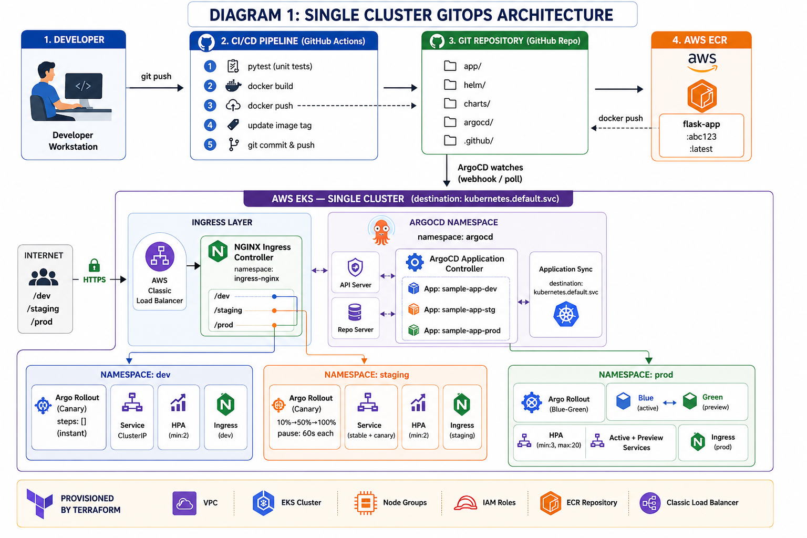
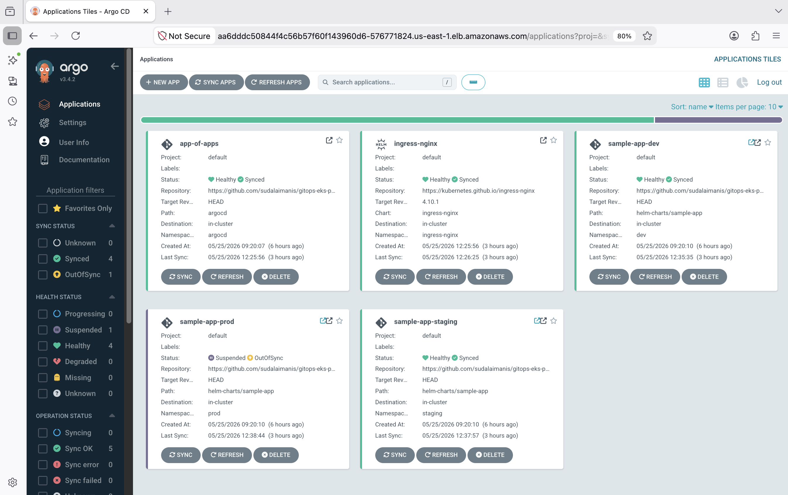
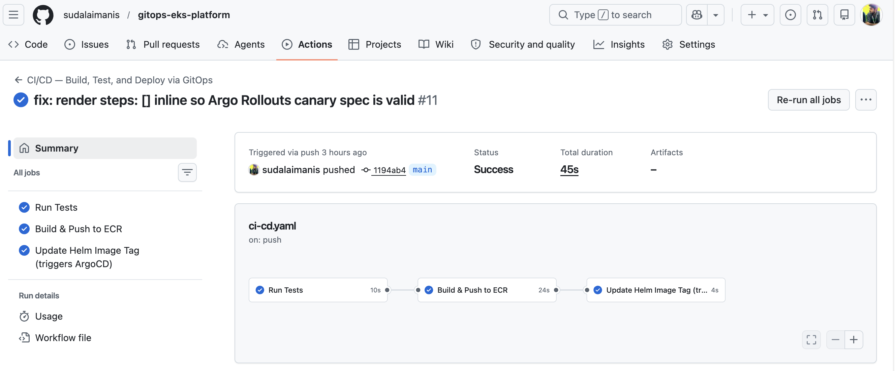
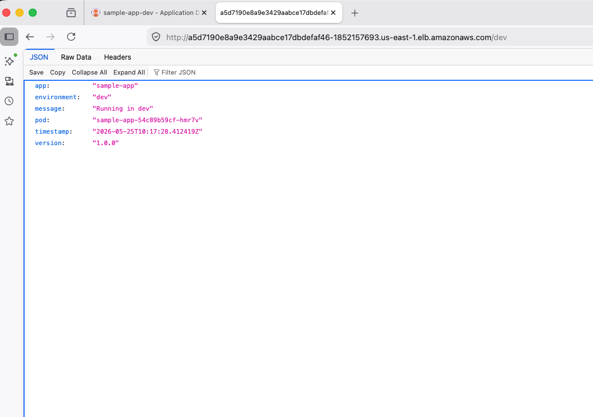
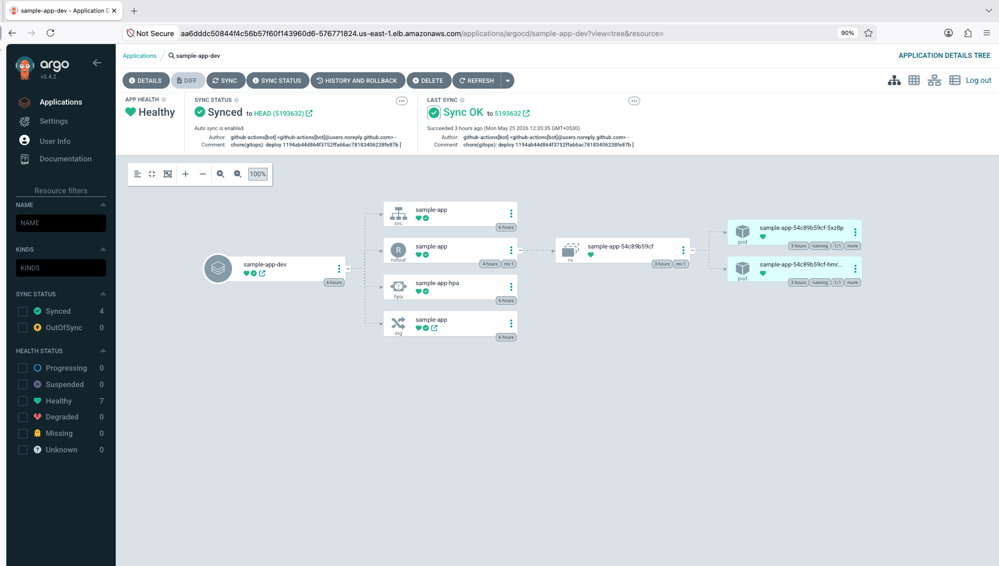
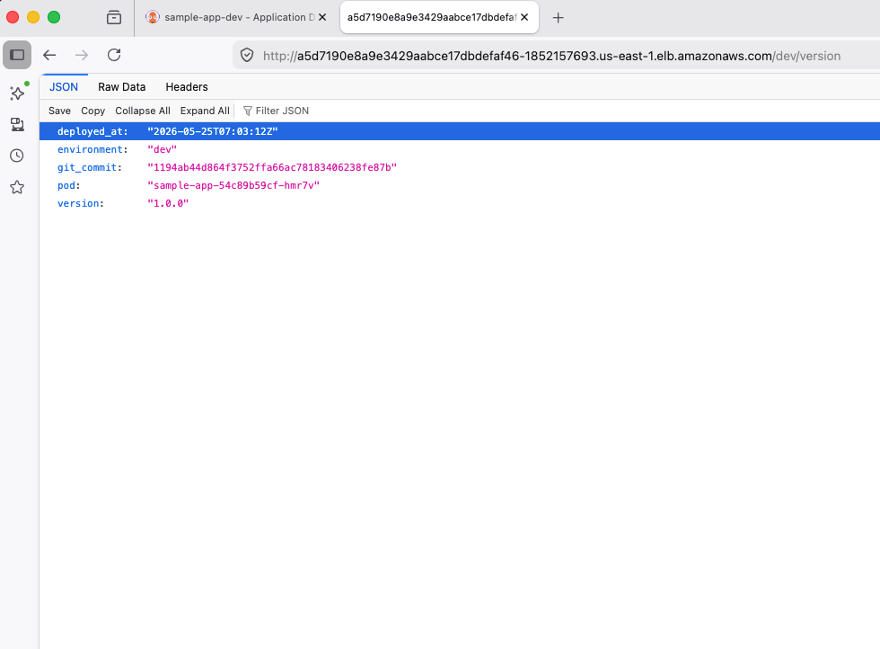
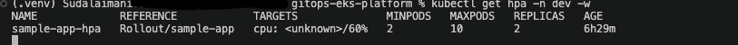
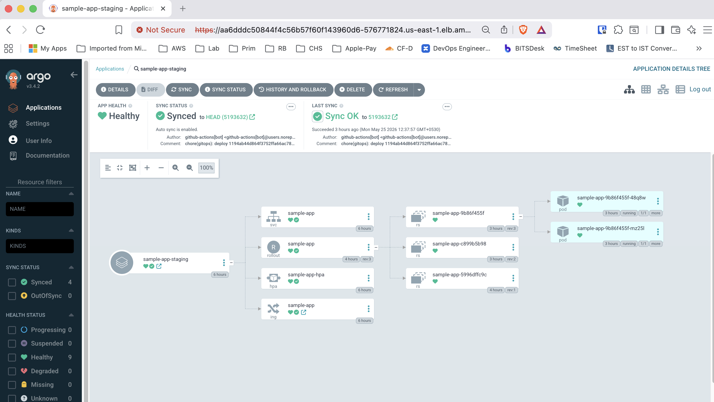
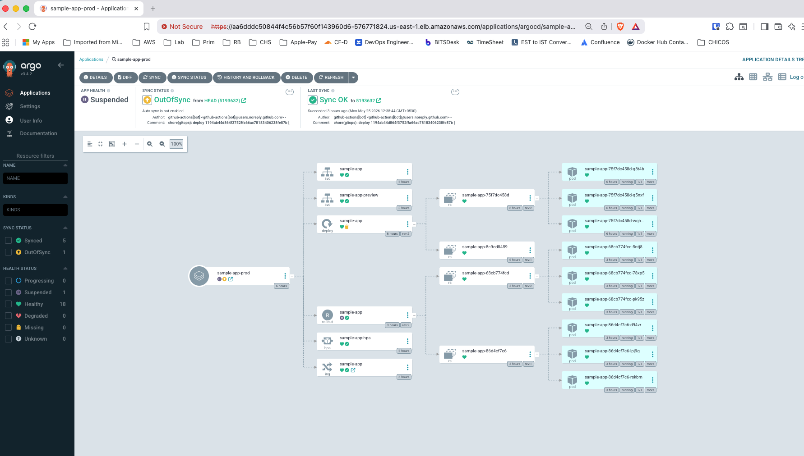

# GitOps-Based Multi-Environment Deployment Platform


> A production-grade GitOps platform on AWS EKS. Git is the single source of truth — every deployment, rollback, and config change flows through a Git commit. ArgoCD watches the repo and automatically syncs the cluster across multiple environments, eliminating manual `kubectl` deployments and configuration drift.

---

## Outcomes

| Metric | Before | After |
|---|---|---|
| Deployment frequency | Baseline | **3x increase** |
| Rollback time | ~30 minutes | **under 2 minutes** |
| Environment drift | Manual reconciliation | **Eliminated** (declarative Git state) |
| Prod deploy risk | Big-bang releases | **Reduced** (canary + blue-green via Argo Rollouts) |

---

## How it works (in one picture)

```
You push code to GitHub
        │
        ▼
GitHub Actions runs:
  1. pytest tests
  2. docker build → push to ECR
  3. updates image tag in values.yaml → git push
        │
        ▼
ArgoCD detects the values.yaml change
        │
        ├──▶ Auto-syncs DEV namespace
        │       └── Argo Rollouts: canary (instant promotion)
        │
        ├──▶ Auto-syncs STAGING namespace
        │       └── Argo Rollouts: canary (10% → 50% → 100%)
        │
        └──▶ PROD waits for manual approval in ArgoCD UI
                └── Argo Rollouts: blue-green (manual promote after validation)
```

---

## Architecture



---

## Repo structure

```
gitops-eks-platform/
│
├── app/                              # The application
│   ├── app.py                        # Flask app (health, version, load-sim endpoints)
│   ├── Dockerfile                    # Container build instructions
│   ├── requirements.txt
│   └── test/
│       └── test_app.py               # pytest tests (must pass before any deploy)
│
├── helm-charts/
│   └── sample-app/
│       ├── Chart.yaml
│       ├── values.yaml               # ← GitHub Actions updates image.tag here
│       ├── values-staging.yaml       # staging overrides (canary strategy)
│       ├── values-prod.yaml          # prod overrides (blue-green strategy)
│       └── templates/
│           ├── deployment.yaml       # Helm template → Argo Rollout resource
│           ├── service.yaml          # Helm template → Service + HPA
│           └── ingress.yaml          # Helm template → NGINX Ingress (path-based routing)
│
├── argocd/
│   ├── app-of-apps.yaml              # Root app — apply this once to bootstrap
│   ├── dev.yaml                      # ArgoCD app for dev namespace
│   ├── staging.yaml                  # ArgoCD app for staging namespace (canary rollout)
│   ├── prod.yaml                     # ArgoCD app for prod (manual sync, blue-green)
│   └── ingress-nginx.yaml            # ArgoCD app for NGINX Ingress Controller
│
└── .github/
    └── workflows/
        └── ci-cd.yaml                # Full pipeline: test → build → push → update helm
```

> **Infrastructure as Code:** EKS cluster, VPC, node groups, and ECR are provisioned via a separate Terraform repo:
> [github.com/sudalaimanis/AWS-EKS-Terraform](https://github.com/sudalaimanis/AWS-EKS-Terraform)

---

## Prerequisites — install these first

| Tool | Version | Install command / link |
|---|---|---|
| AWS CLI | v2+ | `curl "https://awscli.amazonaws.com/awscli-exe-linux-x86_64.zip" -o "awscliv2.zip" && unzip awscliv2.zip && sudo ./aws/install` |
| Terraform | v1.6+ | [github.com/sudalaimanis/AWS-EKS-Terraform](https://github.com/sudalaimanis/AWS-EKS-Terraform) |
| kubectl | v1.32+ | `sudo snap install kubectl --classic` |
| Helm | v3.12+ | `curl https://raw.githubusercontent.com/helm/helm/main/scripts/get-helm-3 \| bash` |
| ArgoCD CLI | v2.9+ | `curl -sSL -o argocd https://github.com/argoproj/argo-cd/releases/latest/download/argocd-linux-amd64 && chmod +x argocd && sudo mv argocd /usr/local/bin/` |
| Argo Rollouts CLI | v1.6+ | `curl -LO https://github.com/argoproj/argo-rollouts/releases/latest/download/kubectl-argo-rollouts-linux-amd64 && chmod +x kubectl-argo-rollouts-linux-amd64 && sudo mv kubectl-argo-rollouts-linux-amd64 /usr/local/bin/kubectl-argo-rollouts` |
| Docker | 24+ | [docs.docker.com/engine/install](https://docs.docker.com/engine/install/) |
| Python | 3.11+ | `sudo apt install python3.11` |

---

## Step-by-step setup

### Step 1 — Fork and clone this repo

```bash
# Fork on GitHub first (click Fork button), then:
git clone https://github.com/YOUR_USERNAME/gitops-eks-platform.git
cd gitops-eks-platform
```

---

### Step 2 — Configure AWS credentials

```bash
aws configure
```

Enter when prompted:
- AWS Access Key ID → your key
- AWS Secret Access Key → your secret
- Default region → `us-east-1`
- Default output format → `json`

Verify it works:
```bash
aws sts get-caller-identity
```

You should see your account ID and user ARN printed. If you get an error, your credentials are wrong.

---

### Step 3 — Run the app locally first (no Kubernetes needed)

Before touching AWS, verify the app runs on your machine:

```bash
cd app
pip install -r requirements.txt
python app.py
```

Open a second terminal and test:
```bash
curl http://localhost:5000/
curl http://localhost:5000/health
curl http://localhost:5000/version
```

Expected output for `/health`:
```json
{"status": "healthy", "pod": "your-machine-name"}
```

Run the tests:
```bash
pytest test/ -v
```

All 6 tests should pass. If they do, the app is good. Now stop the server (`Ctrl+C`).

---

### Step 4 — Build and test the Docker image locally

```bash
cd app

# Build the image
docker build -t sample-app:local .

# Run it
docker run -p 5000:5000 sample-app:local

# Test it (new terminal)
curl http://localhost:5000/health
# Expected: {"pod":"<container-id>","status":"healthy"}

# Stop the container
docker stop $(docker ps -q --filter ancestor=sample-app:local)
```

---

### Step 5 — Provision EKS infrastructure

EKS cluster, VPC, node groups, and ECR repository are provisioned using a dedicated Terraform repo:

**[github.com/sudalaimanis/AWS-EKS-Terraform](https://github.com/sudalaimanis/AWS-EKS-Terraform)**

Follow the setup instructions in that repo. Once complete, you will have:
```
cluster_name  = "gitops-cluster"
ecr_url       = "YOUR_ACCOUNT_ID.dkr.ecr.us-east-1.amazonaws.com/sample-app"
```

---

### Step 6 — Connect kubectl to your cluster

```bash
aws eks update-kubeconfig \
  --region us-east-1 \
  --name gitops-cluster

# Verify nodes are up
kubectl get nodes
```

Expected output (wait 2–3 minutes if nodes aren't Ready yet):
```
NAME                                        STATUS   ROLES    AGE
ip-10-0-1-xx.us-east-1.compute.internal    Ready    <none>   2m
ip-10-0-2-xx.us-east-1.compute.internal    Ready    <none>   2m
```

---

### Step 7 — Install ArgoCD on the cluster

```bash
kubectl create namespace argocd

kubectl apply -n argocd \
  -f https://raw.githubusercontent.com/argoproj/argo-cd/stable/manifests/install.yaml

# Wait for all pods to be Running (~2 minutes)
kubectl get pods -n argocd -w
```

Press `Ctrl+C` once all pods show `Running`.

Get the ArgoCD admin password:
```bash
kubectl get secret argocd-initial-admin-secret \
  -n argocd \
  -o jsonpath="{.data.password}" | base64 -d
```

Access the ArgoCD UI via the LoadBalancer DNS:
```bash
kubectl get svc argocd-server -n argocd
```

Open the `EXTERNAL-IP` in your browser → login with `admin` and the password above.

---

### Step 8 — Install Argo Rollouts on the cluster

```bash
kubectl create namespace argo-rollouts
kubectl apply -n argo-rollouts \
  -f https://github.com/argoproj/argo-rollouts/releases/latest/download/install.yaml

# Verify
kubectl get pods -n argo-rollouts -w
```

---

### Step 9 — Install NGINX Ingress Controller

```bash
helm repo add ingress-nginx https://kubernetes.github.io/ingress-nginx
helm repo update

helm install ingress-nginx ingress-nginx/ingress-nginx \
  --namespace ingress-nginx \
  --create-namespace \
  --set controller.service.type=LoadBalancer

# Get your single ELB DNS — this is how you access all environments
kubectl get svc -n ingress-nginx
```

Copy the `EXTERNAL-IP` — this is your single entry point for all environments.

---

### Step 10 — Update values.yaml with your ECR URL

Open `helm-charts/sample-app/values.yaml` and set your ECR URL:

```yaml
image:
  repository: YOUR_ACCOUNT_ID.dkr.ecr.us-east-1.amazonaws.com/sample-app
```

Commit and push:
```bash
git add helm-charts/sample-app/values.yaml
git commit -m "config: set ECR repository URL"
git push
```

---

### Step 11 — Add GitHub Actions secrets

Go to your GitHub repo → Settings → Secrets and variables → Actions → New repository secret.

| Name | Value |
|---|---|
| `AWS_ACCESS_KEY_ID` | Your AWS access key |
| `AWS_SECRET_ACCESS_KEY` | Your AWS secret key |

> `AWS_REGION` is hardcoded as `us-east-1` in the workflow file — no secret needed for it.

---

### Step 12 — Deploy the App-of-Apps (bootstrap ArgoCD)

```bash
kubectl apply -f argocd/app-of-apps.yaml -n argocd
```

Open the ArgoCD UI — you should see these apps appear:
- `app-of-apps` — the root that watches the `argocd/` folder
- `ingress-nginx` — NGINX Ingress Controller managed by ArgoCD
- `sample-app-dev` — auto-syncs on every push
- `sample-app-staging` — auto-syncs with canary rollout
- `sample-app-prod` — waits for manual Sync click



---

### Step 13 — Trigger your first deployment

```bash
echo "# first deploy" >> app/app.py
git add app/app.py
git commit -m "feat: trigger first gitops deployment"
git push origin main
```

Watch what happens:
1. **GitHub → Actions tab** — pipeline runs: test → build → push to ECR → update values.yaml
2. **ArgoCD UI** — `sample-app-dev` and `sample-app-staging` auto-sync and turn green
3. **Prod** stays yellow — click **Sync** manually when ready



Access your environments via the NGINX ELB DNS:

| Environment | URL |
|---|---|
| Dev | `http://ELB_DNS/dev/` |
| Staging | `http://ELB_DNS/staging/` |
| Prod | `http://ELB_DNS/prod/` |



---

### Step 14 — Verify the deployment

```bash
curl http://ELB_DNS/dev/health
curl http://ELB_DNS/dev/version
```

The `/version` response shows the exact git SHA deployed — proof GitOps is working end to end.





---

### Step 15 — Deploy to production (manual)

1. Click `sample-app-prod` in ArgoCD UI
2. Click **Sync** → **Synchronize**
3. A blue-green rollout starts — green stack deploys alongside blue
4. Validate the green stack, then promote:

```bash
kubectl argo rollouts promote sample-app -n prod
```

---

## How to demo this in an interview

1. Show the ArgoCD UI with all apps green
2. Make a small code change → push to main
3. Show GitHub Actions pipeline running live
4. Show `sample-app-staging` canary progressing (10% → 50% → 100%)
5. Show the `/version` endpoint SHA changing after deploy
6. Show prod blue-green — promote green stack
7. Show rollback in under 2 minutes via ArgoCD History and Rollback

That sequence demonstrates the full GitOps flow end-to-end in under 5 minutes.

---

## How to test HPA (pod autoscaling)

```bash
# Watch HPA in a separate terminal
kubectl get hpa -n dev -w

# Generate load
watch -n 0.3 'curl -s http://ELB_DNS/dev/simulate/load'
```

After ~60 seconds the pod count increases automatically. Stop the load and pods scale back down after ~5 minutes.



---

## How to do a rollback

In the ArgoCD UI:
1. Click `sample-app-dev`
2. Click **History and Rollback**
3. Find the previous version
4. Click **Rollback**

Rollback completes in under 2 minutes.

---

## Progressive delivery with Argo Rollouts

| Environment | Strategy | Behaviour |
|---|---|---|
| dev | Canary (no steps) | Instant promotion — fast feedback loop |
| staging | Canary (10%→50%→100%) | Gradual traffic shift with 60s pauses |
| prod | Blue-Green | Green stack runs alongside blue, manual promotion required |

**Watch staging canary:**
```bash
kubectl argo rollouts get rollout sample-app -n staging -w
```



**Promote prod blue-green:**
```bash
kubectl argo rollouts promote sample-app -n prod
```



**Abort and roll back to blue instantly:**
```bash
kubectl argo rollouts abort sample-app -n prod
```

---

## Multi-cluster support

The ArgoCD app manifests are ready for multi-cluster. Each app targets its cluster via `destination.server`:

```yaml
destination:
  server: https://<cluster-endpoint>.eks.amazonaws.com
  namespace: prod
```

To add a cluster:
```bash
argocd cluster add <context-name> --name prod-cluster
```

Then update `destination.server` in `argocd/prod.yaml` to the new cluster's API endpoint. Everything else — CI pipeline, Helm charts, ArgoCD apps — stays exactly the same.

---

## Cleanup (avoid AWS charges)

```bash
# Delete ArgoCD apps
kubectl delete -f argocd/app-of-apps.yaml -n argocd

# Destroy EKS infrastructure
# Follow cleanup instructions at:
# https://github.com/sudalaimanis/AWS-EKS-Terraform
```

---

## Author

**Sudalaimani S** — DevOps Engineer
[LinkedIn](https://www.linkedin.com/in/sudalaimanis/) | [GitHub](https://github.com/sudalaimanis)
